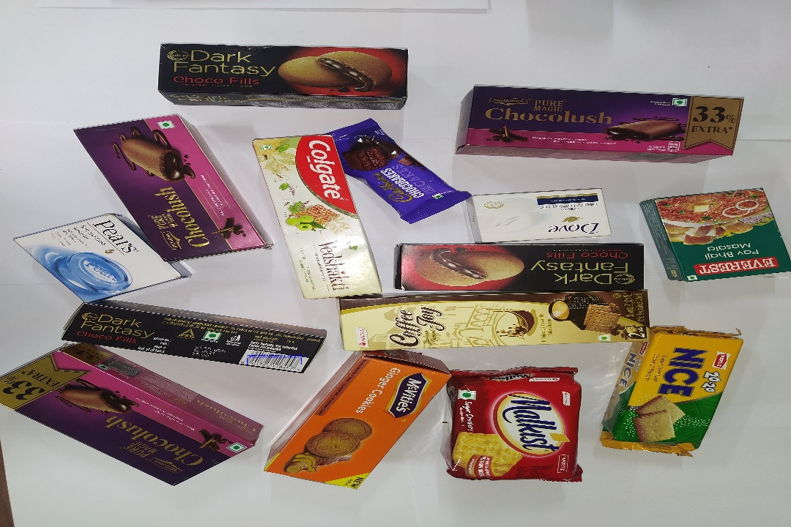
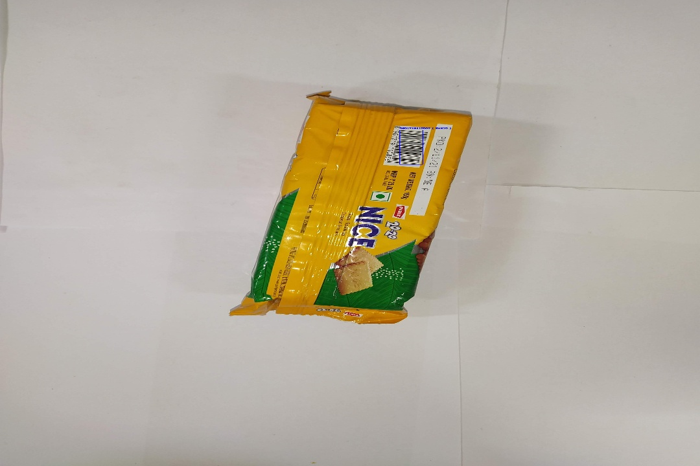

# Barcode-Detection-and-Decoding
Barcode detection and decoding using openCV and pyzbar.

Update image path in code and run below line in terminal.
```
1. python barcode_detect_and_decode.py
'To detect and decode the barcode.'

2. python detect_barcode_opencv.py
'Get bounding box around the images having barcode.'

```

# Methodology
This is a rule based approach where we are using predefined kernels. 
</br>
# Approach Result

</br></br>
# Results

<a href = "https://drive.google.com/drive/folders/1-cw_4GcHutalyS3KRm1h1Mt7Iyf0d7oU?usp=sharing">Rule Based Approach Results Samples</a>

</br></br>
</br></br>
