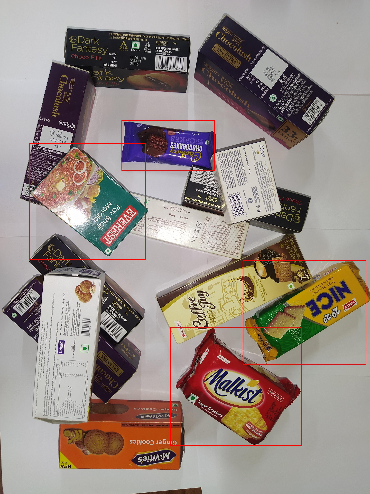

<h1>MRCNN-No-Barcode</h1>
Using Mask-RCNN model to indentify object which doesn't have barcode(Red Bounding Box around it). 

I have use Detectron2 framework for MRCNN model: <a href ="https://github.com/facebookresearch/detectron2/blob/main/configs/COCO-InstanceSegmentation/mask_rcnn_R_101_FPN_3x.yaml"> Model Configuration</a>

<h2>Model training and testing</h2>
<ul>
<li><b>For Pretrained weights for directly testing: <a href = "https://drive.google.com/file/d/1waxWQuBIT9n7D_V8bhveu-MYL_BxpK2-/view?usp=sharing"> Weights</a></b><br/>
<li><b>Pickle File: <a href = "https://drive.google.com/file/d/1QTY97vH7NY6uztGuId66CR8o0wmAbcwu/view?usp=sharing">Pickle file</a></b><br/>


<li><b>You can download dataset from here: <a href = "https://drive.google.com/file/d/1yfKEuFHSidBIfowStxsnksqWPk_zv7lA/view?usp=sharing">Dataset</a></b>

</ul>

For Training I have used 13 images annoted using VGG 
annotator.

To train model using your own data use: ``` 
Mask detectron2-model-r101-fpn-Training.ipynb ```

For testing use: ``` 
Mask_detectron2_TableDetection_R101-FPN.ipynb ```

Change the path of pickle file and weights accordingly.

<hr>
Training time: approx 2 hrs<br>
Testing time per image: 2 sec approx

<h1>Results: </h1>
<a href = "https://drive.google.com/drive/folders/1swErd-9bdb3pXZFerc8kMOJaqwXqvITc?usp=sharing">Model outputs</a>
<br>



<h2>Future Work</h2>
As in this particular case it is hard to explain whether out model is learning what we want it to learn i.e, look at object find if there is barcode or not if not draw a bounding box. 
We can use <b>Intel OpenVino Toolkit</b> to analyze the model. 