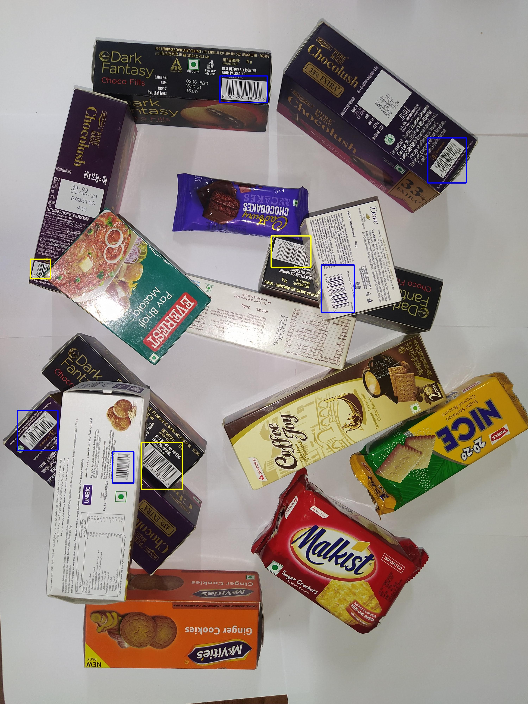
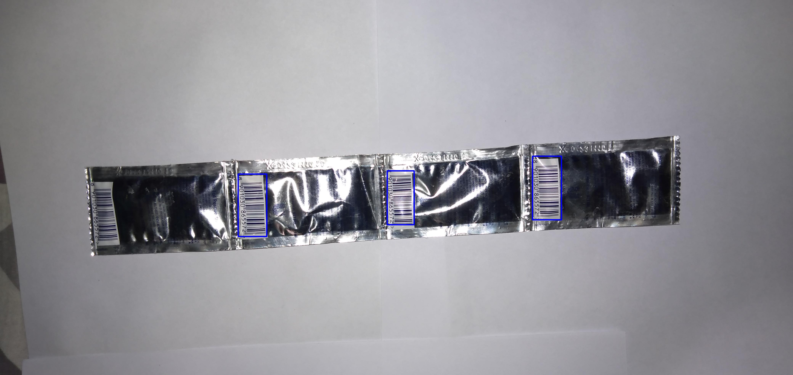

<h1>MRCNN-Complete-Or-Partial-Barcode</h1>
Using Mask-RCNN model to classify the image in class if complete barcode(blue box) is visible or partial barcode(red box) is visible. 

I have use Detectron2 framework for MRCNN model: <a href ="https://github.com/facebookresearch/detectron2/blob/main/configs/COCO-InstanceSegmentation/mask_rcnn_R_101_FPN_3x.yaml"> Model Configuration</a>

<h2>Model training and testing</h2>
<ul>
<li><b>For Pretrained weights for directly testing: <a href = "https://drive.google.com/file/d/15WMPNvcvFodxtYfr8FJFVYz8gHuokrTS/view?usp=sharing"> Weights</a></b><br/>
<li><b>Pickle File: <a href = "https://drive.google.com/file/d/1f7ykNlqt9MQp6CRRI50ytFdSCePzP19o/view?usp=sharing">Pickle file</a></b><br/>


<li><b>You can download dataset from here: <a href = "https://drive.google.com/drive/folders/1bxoRNTp0St4h9tVkJSNQTb0ItwUYKbEo?usp=sharing">Dataset</a></b>

</ul>

For Training I have used 13 images annoted using VGG 
annotator.

To train model using your own data use: ``` 
Mask detectron2-model-r101-fpn-Training.ipynb ```

For testing use: ``` 
Mask_detectron2_TableDetection_R101-FPN.ipynb ```

Change the path of pickle file and weights accordingly.

<hr>
Training time: approx 2 hrs<br>
Testing time per image: 0.5 sec approx

<h1>Results: </h1>
<a href = "https://drive.google.com/drive/folders/1xg7vlsH_0tdHc_cL-bYl8k8vsH8jdYw-?usp=sharing">Model outputs</a>
<br>



