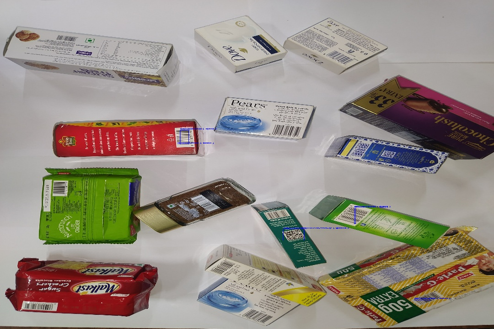
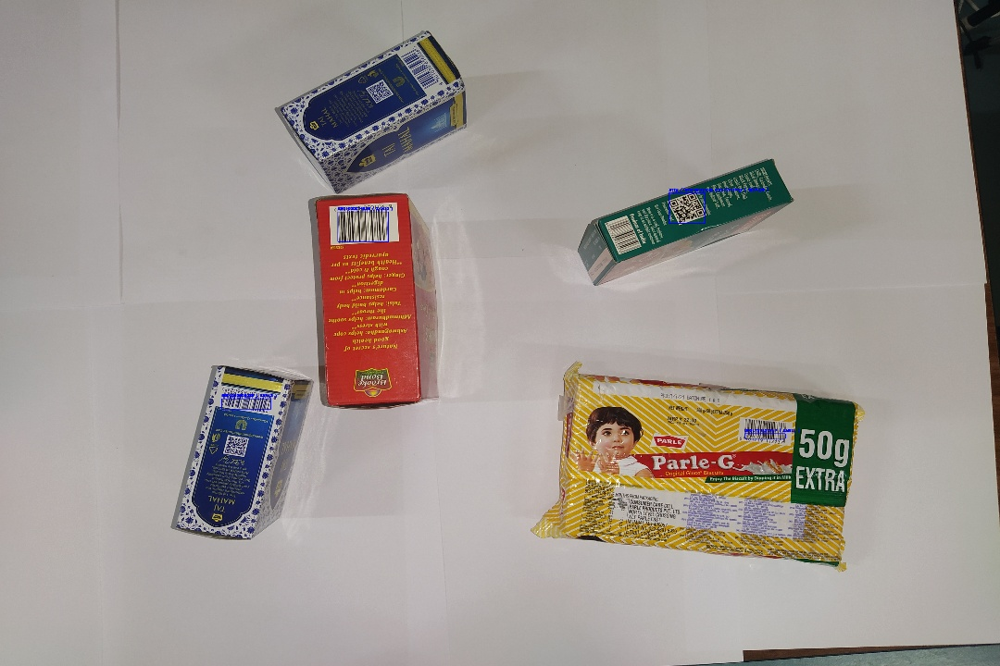
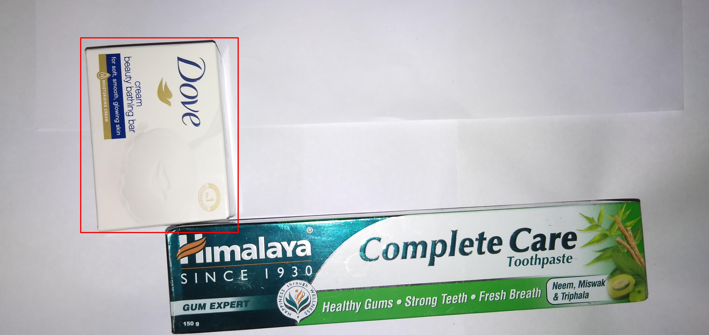
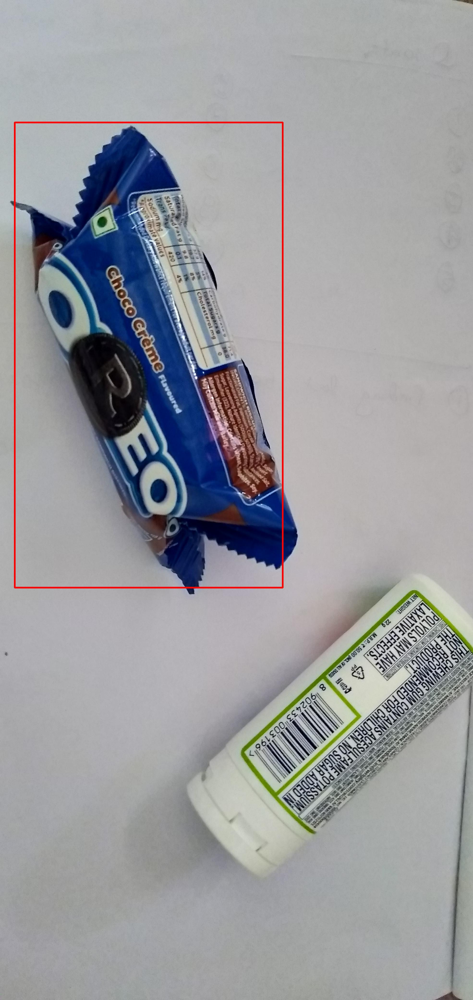
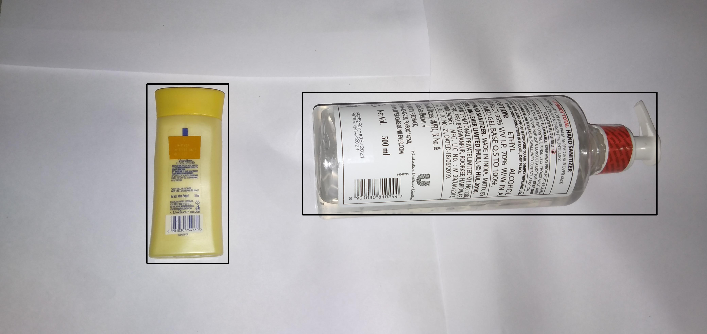
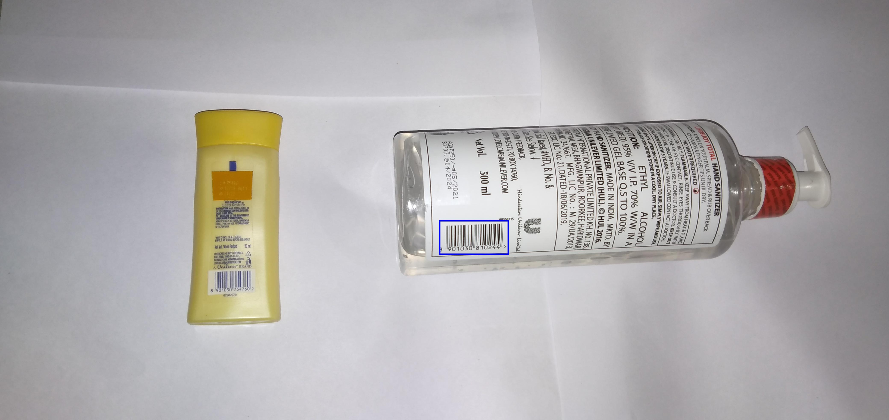

<h1>Barcode Decode and Detect</h1>


```
cd {Directory name}
```
<h2>Rule Based Approach: <a href = "https://github.com/jprakash-1/Barcode-Decode-and-Detect/tree/main/Barcode-Detection-and-Decoding">Link</a></h2>
Built using OpenCv and pyzbar using hard-coded kernel functions. <br>




<h2>Deep Learning Approach for all the cases.</h2>
To achieve the goal I have used Mask-RCNN Instance segmentation model using detectron2 framework. 

<h2>MRCNN No Barcode: </h2>
Model create red bounding box around the object which doesn't have barcode visible.



<h2>Bounding-Box-Around-All-Object</h2>
Detect all object and draw black bounding box around it.



<h2>MRCNN-Complete-Or-Partial-Barcode</h2>
Model draw blue bounding box around complete visble barcode otherwise yellow bounding box.



<h1>Result analysis: </h1>
Since I have use very less data around 10-12 images in each case, We can observe from result that it is overfitting case. 

We can take actions to improve the result such as: 
<ul>
<li> Increase the number of data.
<li> Data Augmentation it will help but only upto some extent.
<li> Try experimenting with some other models.
</ul>

I have also look into some pretrained model for barcode detection but they are have dataset diffrent from the provided dataset, becasue of that dataset shift I avoided using those models. 

